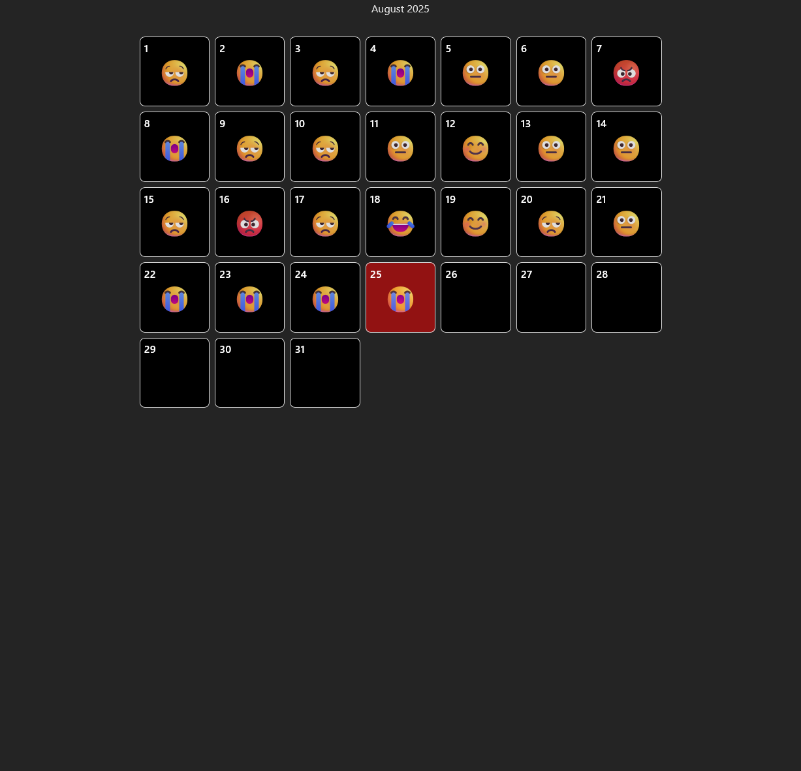
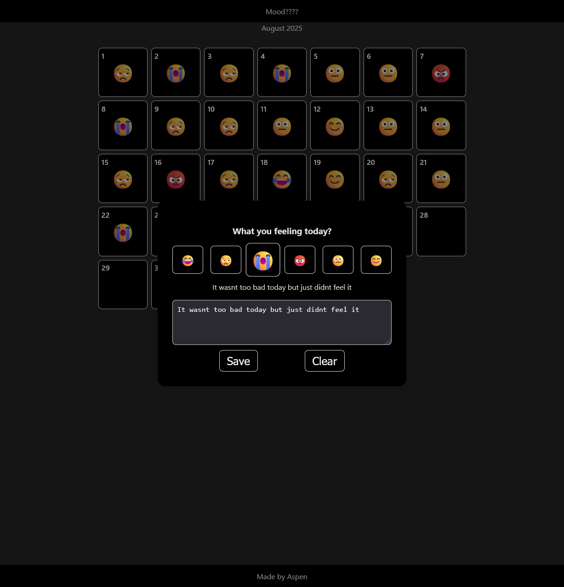

# Mood Tracker (React + TypeScript)

A lightweight web app for tracking daily moods and reflections built with React + TypeScript.

**Live Demo** (https://mood-tracker-aspen13s-projects.vercel.app/)

---

## Motivation

I built this project to improve my React and TypeScript skills, focusing on state management and local persistence.  
It also serves as a simple, practical tool for daily reflection.

<table>
  <tr>
    <td></td>
    <td></td>
  </tr>
  <tr> 
    <td>*Calendar view with tracked moods*</td>
    <td>*Pop-up emoji selector and note input for the chosen date*</td>
  </tr>   
</table>

---

## Features:

- Interactive calendar - click a day to log your mood
- Emoji-based mood selector with popup overlay
- Data persistence using LocalStorage
- Add a short text for each day
- Clear or reset mood and text easily
- Fully responsive, minimal UI
- Highlights todays date and shows month at the top

---

## Tech Stack

- **React**
- **TypeScript**
- **LocalStorage**
- **Versel for deployment**

---

## Getting Started

Clone the repo and install dependencies:

```bash
git clone https://github.com/Aspen-13/MoodTracker.git
cd MoodTracker
npm install
npm run dev
```

Open http://localhost:3000 to view in browser

---

## Future Improvements

- Graph to visualise mood trends over time
- Backend integration with cloud storage + user accounts
- Daily reminder
- Dark/Light theme toggle

---

## License

[MIT License](LICENSE).
